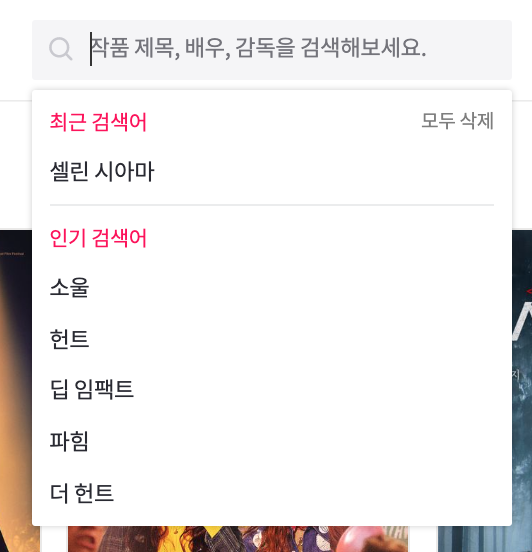

# 자료 조사
- 벤치마킹: 왓챠피디아(https://pedia.watcha.com/ko-KR)
## 1. 메인 화면
 
- 심플하게 최소한의 정보만 보여줌
- 헤더, 메인, 푸터
- 헤더: 로고, 카테고리, 검색, 로그인, 회원가입
  - 우리 프로젝트 같은 경우 카테고리가 영화밖에 없어서 어떻게 할지 고민 필요
  - 검색 쿼리문 많은 고민 필요할 듯
### 1.1. 검색
 

- 연관 검색어(무리일 듯?)
- 최근 검색어(얘도..)
- 자동완성(까지는 할 수 있을지도)
## 2. 검색 결과 화면
 

- 상위 검색 결과, 영화, 사용자 정도 보여주면 될 듯
## 3. 영화 클릭했을 때 나오는 화면

- 헤더 배경에 영화 메인 사진
- 보고싶어요(=마이페이지에 담기=장바구니 같은 기능)
- 평가하기(별점)
- 영화 기본정보, 출연/제작, 별점 그래프, 코멘트, 비슷한 작품, 감상 가능한 곳
  - 출연/제작 - 슬라이더
### 3.1. 비회원
 
- 영화 정보만 조회 가능하고 별점 남기기, 보고싶어요 담기 등은 로그인해야 가능
### 3.2. 회원
 
- 별점 0.5점 단위로 평가 가능
- 보고싶어요, 보는중, 코멘트 남기기, 관심없어요
- 내가 좋아할 이유 - 선호하는 태그랑 엮는 것 괜찮아보임
#### 3.3.1. 코멘트 남기기

- 심플한 게 눈에 띄네요
## 4. 코멘트 리스트

- 생각보다 심플함.
- 페이징으로 구현하면 될 듯
## 5. 평가하기
- 회원의 취향을 더 정확하게 파악하기 위한 절차인 듯
- 알고리즘 구현해야하는데 가능할지
 
 
## 6. 마이페이지

- 생각보다 심플해서 놀람..;
### 6.1. 영화

- 평가한 영화들, 보고싶어요, 보는중 체크해놓은게 나옴(장바구니 or 주문조회 개념)
- 영화 포스터 누르면 영화 상세보기 페이지로 넘어감
- 보고싶어요, 보는중이 없을 때 메시지 아무것도 안 띄우는 건 좀 아쉬움
- 오른쪽의 `더보기` 누르면 
 
- 이 화면이 뜨는데, 담은순/평점순/가나다순/개봉일순 등 정렬 조건 다양하게 있음
- 이 화면을 마이페이지 메인으로 가져와도 괜찮을듯
 
- 별점 순으로도 볼 수 있음
- 내가 남긴 코멘트 볼 수 있는 화면도 필요할 듯..?(가능하다면)
### 6.2. 설정
 
- 이메일로 가입하는 거라 그런가? 비밀번호 변경하는 부분이 없음
  - 왜 없을까..
- 공지사항, 문의하기, FAQ 등등 고객센터 개념이 여기로 들어와있는 것도 인상적

### 6.3. 취향분석
 
- 고객이 이용한 통계 보여주는 개념
## 7. 고객센터
 
 
- 문의하기 들어가면 회원이 문의한 내역 뜨고, FAQ 누르면 페이지 뜸
- 질문을 누르면 새 페이지로 넘어감 -> 같은 페이지에서 보였다가 사라지게 구현하면 좋을 듯

## 8. 공지사항
 
- 얘는 또 드롭다운임.. 기준이 뭐여